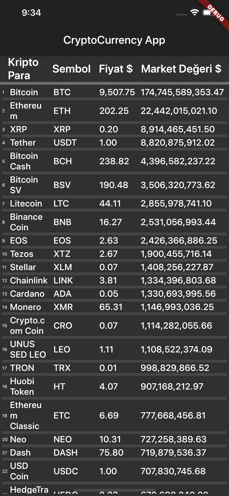

# crypto_app

A Flutter project that demonstrates how to make network calls, how to use JSON decoding and some UI improvements for beginners. To execute the app, you may create required files with 'flutter create .' command.

Also, you can obtain coinmarketcap api key to fetch latest data or you may prefer to use json variable to list the pre-created information. 

## Getting Started

This project is a starting point for a Flutter application.

A few resources to get you started if this is your first Flutter project:

- [Lab: Write your first Flutter app](https://flutter.dev/docs/get-started/codelab)
- [Cookbook: Useful Flutter samples](https://flutter.dev/docs/cookbook)

For help getting started with Flutter, view our
[online documentation](https://flutter.dev/docs), which offers tutorials,
samples, guidance on mobile development, and a full API reference.
